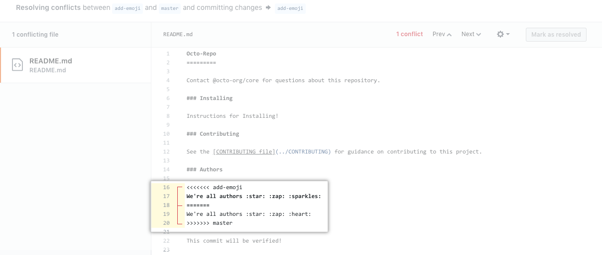

A pull request, or referred to as merge request, is a functionality/feature in GitHub that allows a developer to notify other project collaborators about the pushed changes to a branch in a repository, requesting for these changes to be compared/reviewed and eventually be approved to merge to a base branch. It is mostly a transaction between member and team/project lead or any assigned reviewer to review the code and discuss any potential changes to the code before applying it. This is a vital step in source code management because it provides a layer of protection to the source code.

## Do's and Don'ts - PRE/POST Pull Request
1. Before you start coding, you first have to verify the branch you are currently working in. In maintaining code, it is the law to never write in the main branch. Always checkout to a different branch to avoid messing the main code. If you push while in the main branch, the changes will automatically and directly be applied to the source code which is not ideal. Thus, practice to create or switch to a separate branch and code there.
       
       git branch - to check current working branch
       git checkout -b <branch name> - to create and switch to specific branch
       git checkoout <branch name> - to switch to an existing branch

2. Another thing to do before coding is to always fetch the latest updates in the remote repository. This ensures that your local repository is up-to-date thus minimizing the chances of merge conflicts.

      A merge conflict is an event in git that arises when Git cannot automatically resolve differences between two commits. Simply put, there is an overlap happening between the commits. 

      Below is an example of a merge conflict.

      

      To fetch and merge remote repository updates to local repository, use command below.
 
       git pull - to fetch and download latest contents from the remote repository 

3. Git add files individually, never use "." to avoid including unnecessary files to track.

       git status - to check files that are untracked
       git add . - only use this if there is only one file untracked
       git add <file> - use command to track changes of specific file

4. When committing your changes make sure to give descriptive and meaningful commit messages. This is important for tracking commit logs. 

       git commit -S -m <message> - command used to take a snapshot of the files tracked. Note: "-S" is used to create signed commits. As for now, you can skip it.

5. In creating a pull request, same as mentioned above, do give meaningful/appropriate title and description to your pull requests. This is to help the reviewer know what the code is about.

6. When your pull request is approved and changes are merge to the base branch, please practice to delete the branch you used and checkout to the main/base branch and perform "git pull". 

   To delete a branch using GitHub interface, follow the images below:

   
   
   

   To delete branch using cli, follow code below.

       git checkout <main/base branch> - to switch to another branch. Note: You cannot delete a branch is your working in it.
       git branch -d <compare branch name> - use this command to delete branch using cli

   Finally, perform a "git pull".

       git pull - use command to fetch and download latest contents from the remote repository

## Pull Request Process

1. To create a Pull Request in GitHub is simple and straightforward. Once you have pushed your local commits to the remote repository, go to the GitHub website and open your repository. A highlighted container will appear. 
   
     
   Click "Compare & Pull Request".

   If no highlighted container appears. You can simply go to "Pull Requests" and click "New pull request".

   

   Note: Make sure you select the correct base and compare branch for the pull request.

   
   

2. A pull request form will appear. Again, as suggested in the "Do's and Don'ts", give descriptive/meaningful title and description of the request.

   

   When you have filled out the form, simply click "Create Pull Request" and you are done.

3. Once it is created, it is open for discussion and modifications.

   
4. The assigned reviewer will then review the code. They can give feedback or request modifications/changes which are added in as comments near the code line.

   

5. The developer will resolve these issues and replies to the reviewer. This cycle will continue until all issues are addressed/resolved.

6. Once all discussions/issues are resolved, the code will then be merged to the base branch selected when the pull request was created.

## Conclusion

The biggest advantage to utilizing pull request is that they present an opportunity for a code review. Code review is a crucial process in software development. It allows members of the team to collaborate and assess each other's work. Ensuring that the code is free from bugs and defects, and also suggest enhancements.  

   
   

