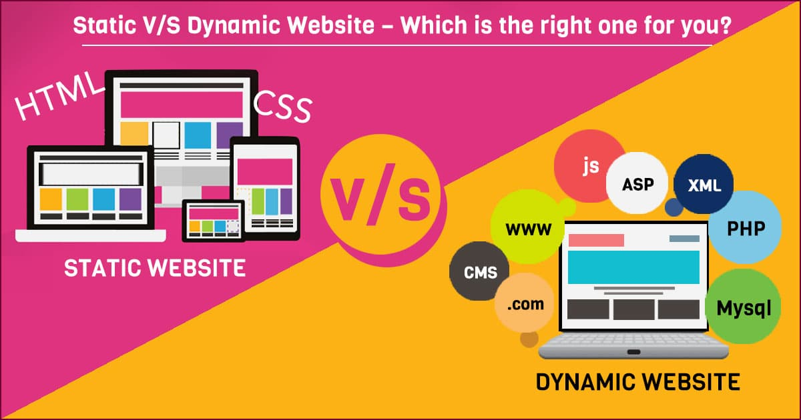

Websites can be classified as either static or dynamic. Static websites, which are often made entirely of HTML, are fixed and show the same content to every user. A dynamic website, on the other hand, uses advanced programming and databases in addition to HTML to display different material and allow user interaction. As you can see, creating static websites is simpler than creating dynamic ones. However, this does not mean that static sites are better than dynamic sites (vice versa). 

In this article, we will explore the pros and cons of Dynamic and Static sites. And hopefully, through reading this guide, you will learn to distinguish between dynamic and static websites and decide which of the two is right for you. Without further ado, let us begin with dynamic websites. 

## Dynamic Website
Dynamic sites are websites that change content or layout upon request to the server. It utilizes server-side and client-side scripting, to dynamically create a webpage when a user visits the page. It also uses a database to store and manage user information/data. Simply put, users can interact with it and a page's content changes depending on user inputs.

Although dynamic sites are extremely powerful they are also complex. However, along with this complexity are numerous advantages and disadvantages.

**ADVANTAGES**

- _Provides better User Experience_ 
  
  A dynamic website is one that is highly user-friendly and enables users to make modifications to the website as needed.
  These websites allow visitors to submit comments or responses based on their interactions with the website.
  This enables the developers to get immediate feedback on their work, which they can then improve.
  It is possible to create easy navigation, adding and upgrading functionalities, and so on fast and effectively, all of which will enhance the overall experience.

- _Easier Updates_

  The main benefit of a dynamic website is that it is simple to change according to the requirements of the website owner.
  A single update to the template file will change the design of all the pages that use that specific file, thus modifying a dynamic website does not need advanced technical skills.
  It can be swiftly modified to adapt to different screen sizes, which was not feasible with a static website.

- _Easily Manageable_

  Dynamic websites make utilizes scripting languages that interact with the information in the databases, making it simple to implement site-wide updates without having to do it one at a time.

- _More personalized Browsing_

  The ability to give users a personalized browsing experience is one of the most important benefits of having a dynamic website.
  This includes content and product recommendations, recently viewed products, and content basing on location and demographic which helps keep visitors to your site.

  

**DISADVANTAGES**

- _Slower Processing_ 

  As mentioned, dynamic websites offers better user experience compared to static websites. Web pages are generated as per user's input which exerts a major toll on server resources. As a result, the server has bottlenecks, and end users have delayed response times.

- _Costly_

  Compared to creating a static website, creating a dynamic website might be more difficult.
  As a result, developing a dynamic website will be more expensive and need significant resources to develop and maintain. 