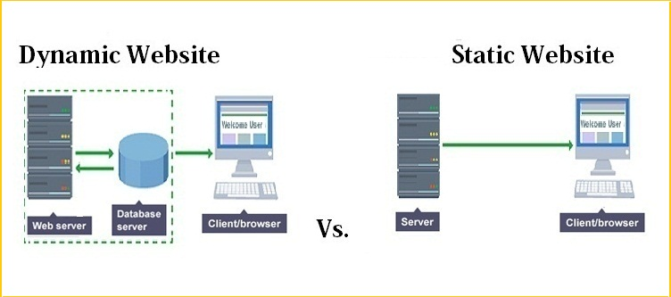

Now that we know what dynamic sites are. Let us discuss **Static Sites**.

Originally, websites were basically just static HTML pages. However, as time passed, users began to expect better performance, and developers wanted intuitive workflows which erected dynamic websites. But this does not mean that static websites are obsolete. In fact, static sites are the go-to for publishing a website that doesn't require ongoing or expensive hosting. It is popular among small businesses, bloggers, content creators, etc.

## So, what is a static site?

A static site is a website composed of HTML files, wherein each file represents a physical page of a website. As the word "static" suggests, its code is fixed but can be updated manually. Static web pages are delivered to the user's web browser exactly as stored. Thus, the same content is delivered every time the page is loaded.

  
As shown in the illustration above, static web pages are passed straight from the web server to the user's browser. On the other, with dynamic web pages, the server processes scripting language, query database, and other functions then finally pass the result to the browser. With these steps gone, static sites are extremely fast and easy to maintain. 

**Why build a Static Website?**

Since static web pages are pre-built files. It only communicates with the backend when there are changes to the content instead of at every request. It also does not send information to the server. This results to faster performance such as page load speed. Another, good thing about static sites, it that they work particularly well for basic sites or sites with pages that uses the same general structure such as blogs.

**How to build a Static Website?**

Are you planning to create a static site? Then use a static site generator! Static Site Generators are tools widely used today to create static HTML web pages. It lets you apply templates to your content and data which makes it much simpler to build the site you wanted. There are dozens of static site generators today that you can enjoy.

Here are a list of popular SSGs available:

- Next.js - is a popular web development framework for static React applications.
- Gatsby - one of the most popular React-based static site generator
- Jekyll - a Ruby-based static site generator.
- Nuxt.js - it is similar to Next.js, except that it is based on Vue rather than React.
- Hugo - is a static site generator written in Go.

Once your site is written or generated, you can now put it on the internet. Now, to deploy your site. 

Here are cheap and free hosting options for you.

- GitHub - one of the easiest ways to get a basic static site online.
- Netlify - also offers free hosting for static sites.