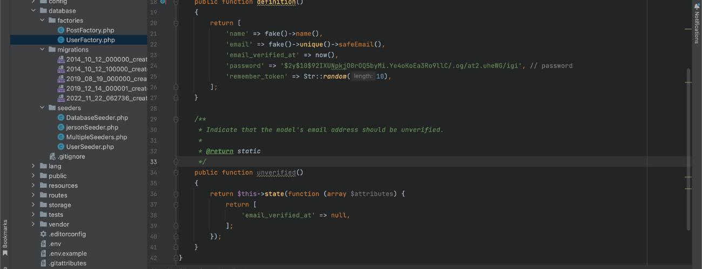

Web application frameworks  according to GeeksforGeeks as "a software framework that is meant to assist the creation of web applications including web services, web resources, and web APIs." In layman's terms, web frameworks are pieces of software that allow you to design and execute web applications. As a result, you don't have to write on your own and hunt for any errors and miscalculations.

Web frameworks were established in the early days of web app development as a way to eliminate hand-coding of apps where only the creator of a specific app could update it. The advancement of web development now we have web-specific languages that allow developers to solve altering the structure of an app has been overcome by the emergence of general performance. In this article, we are going to focus on the Laravel web application framework specifically for **Laravel seeding**

## Laravel php web application framework
Laravel is a reliable and simple-to-use open-source PHP framework. It adheres to the model-view-controller pattern of design. Laravel makes use of pre-existing parts from other frameworks to build online applications. The resulting web application is more organized and practical.

Incorporating the fundamental components of PHP frameworks like CodeIgniter and Yii as well as other programming languages like Ruby on Rails, Laravel provides a wide range of functionalities. The extensive feature set of Laravel will accelerate web development.

<br>

## Laravel seeding
**What is seeding?** To make it simple Data seeding is the process of populating a database with an initial set of data.

In Laravel December 24, 2020. Database seeding is the process of populating data tables with fictitious data. This procedure is used by developers for testing. Using seeder classes, Laravel allows you to fill data tables with test data. The database/seeds directory contains all seeder classes.

Laravel offers the ability to use seed classes to populate your database with data. The database/seeders directory contains all seed classes. 

<br>

## Now you what is seeding, let's try a little demonstration for seeding

I assume that you already created your Laravel project and configure the connection for your preferred database. If you haven't created your `Laravel project` you start by following this command below: 

**Create Laravel project:**

```
composer create-project laravel/laravel [project_name]
```

**Change directory:**

```
cd /.../[project_name]
```

**Let's try if you can use PHP artisan command:**

```
php artisan list
```

After running the command `php artisan list` it will show you the all the command available for laravel project.

<br>


I am assuming that you can connect with your preferred database, if you haven't you can configure your connection on your `.env` file in your Laravel project.

**Sample code:**


<br>


## Laravel seeding 
Now that you created your fresh Laravel project we will proceed with creating and running seeders in your Laravel project

In your Laravel project, you have the capability to seed your database with data using seed classes. Laravel project store your seed classes inside the `database/seeders` directory. 

## Writing seeders
In writing seeders in laravel your need to the following:
- Using model factories
- Call seeders
- Muting Models Events (optional)

Creating / making seeders in laravel is pretty straight forward just follow the steps below:

**To generate a new seeder, execute the following command `make:seeder`. All of your seeders will be placed in the `database/seeders` directory of your Laravel project.**

```
php artisan make:seeder [seeder_name]
```

After you able to make the seeder, go to your `database/seeders` folder and open the seeder class that you created. 
Inside your seeder class you can see that there is a `run()` method already generated in your seeder class. The `run` method will be one `php artisan` will execute when you run your seeder class later.


<br>
Additional information, if you are having trouble making commands on your Laravel you can use this to know all the commands you can use PHP artisan list on your Laravel project.

```
php artisan list
```

In your `run() method` you can try to insert this following code:


```
use Illuminate\Database\Seeder;
use Illuminate\Support\Facades\DB;
use Illuminate\Support\Facades\Hash;
use Illuminate\Support\Str;
```

```
 public function run()
    {
        for($i = 0; $i <10; $i++){
            DB::table('users')->insert([
                'name' => Str::random(10),
                'email' => Str::random(10).'@gmail.com',
                'password' => Hash::make('password'),
            ]);
        }
    }
```

<br>
Your run method inside the seeder class that you created should look like this by now.

<br>

Sample: 


**What does this code do? In this snippet code we are seeding our user's table 10 random data for `name, email and password`**


<br>
Sample: 


After that you need to run this to your command:

```
php artisan db:seed --class=[class name]

```
With command, you are able to seed your database `users` table.


After you are able to successfully execute the `php artisan db:seed` if you check your database, your database should have a table named `users` with 10 row of data.

Sample: 


<br>

## Model factories 
As a developer it is not efficient to manually specify the attributes of your seeder class. What we can do is we can utilize Laravel model factories which automatically generate of database records for you.

Follow the command below to  generate your custom `factory`:

```
php artisan make:factory [factory_name]

```
after you execute the command your factory will be located in your `database/factories`.
`

In your database factories, you can see there is already a `UserFactory` generated in your directory. For now, we can utilize that factory use it for the user `users table`. It should look like this:



Let me explain what is happening in this code snippet. In your `UserFactory` there is a `definition()` what does it do? 
The `definition` method returns the default set of attribute values that should be applied when creating a model using the factory.

In our factory, we are going to utilize `Faker PHP library` which can use to generate random data for seeding. The php faker library offers different data that it can generate. This is some of the following data list that faker offers:

**Faker Generate the following data**
- Base
- Lorem Ipsum Text
- Person
- Address
- Phone number
- Company
- Reat Text
- Date and Time
- Payment
- Color
- Uuid
- File


Let's try to use our UserFactory sample to seed 100 data for user tables.

Replace the inside of your `run()` in your seeder with this:

```
[table_name]::factory()
            ->count([data_size])
            ->create();
```

run the command calling your seeder class:

```
php artisan db:seed --class=[class name]

```

Your database should be seeded with data depends on what is the size you specify in your count method for your `factory()` method.


<br>

## Running multiple seed classes

To run multiple seeder classes at one seeder class you need to utilize the call function in your project which will execute the other seeder classes that you want to run. The call method accepts an array of seeder, follow the command below:

Let's create a new seeder class which will use to run multiple seeders:

```
php artisan db:seed --class=[class name]

```

After tha, in the run method we are going to use the call method to execute our seeders:


```
        $this->call([
           [class_name]::class
           [class_name]::class
           [class_name]::class
        ]);
```

For now, as what did above you need to create a factory for each of your seeder classes. After your created your seeder `factories and models`. Let's run the multiple seeders at once using your created seeder class to hold your multiple seeder classes:

Sample:


```
php artisan db:seed --class=[class_name]
```

In this way, you can execute `multiple seeders` in one seeder class.

<br>

## Conclusion

In your, Laravel project choosing between two ways of handling your database table data, can be difficult. To answer this question, it depends on what is your project's current state and needs. Both are powerful database utilities that you can use. If you are looking for a way to casually populate/seed your database table you can use seeder if you want to test your fresh Laravel project. Migrations, on the other hand, are another way of handling your data from the database, which offers better capability the only seeding itself, migrations are designed to handle the creation of tables, adding and modifying your database schema and tables columns.


