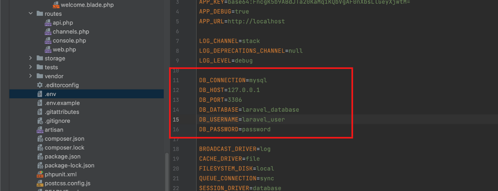
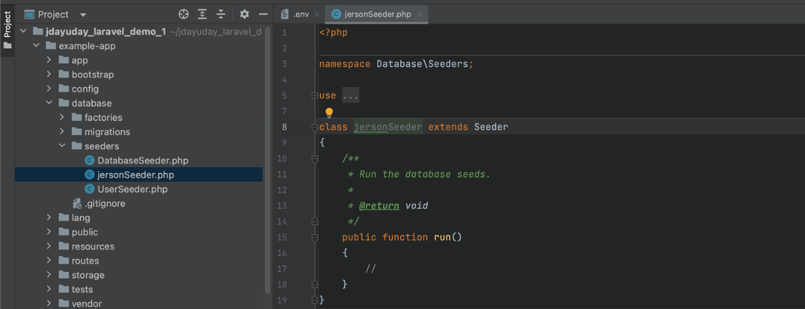
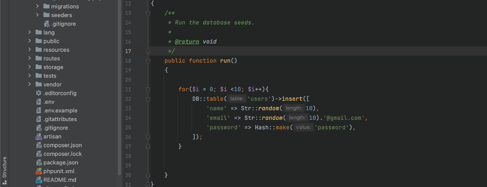

Web application frameworks  according to GeeksforGeeks as "a software framework that is meant to assist the creation of web applications including web services, web resources, and web APIs." In layman's terms, web frameworks are pieces of software that allow you to design and execute web applications. As a result, you don't have to write on your own and hunt for any errors and miscalculations.

Web frameworks were established in the early days of web app development as a way to eliminate hand-coding of apps where only the creator of a specific app could update it. The advancement of web development now we have web-specific languages that allow developers to solve altering the structure of an app has been overcome by the emergence of general performance. In this article, we are going to focus on the Laravel web application framework specifically for **Laravel seeding**

## Laravel php web application framework
Laravel is a reliable and simple-to-use open-source PHP framework. It adheres to the model-view-controller pattern of design. Laravel makes use of pre-existing parts from other frameworks to build online applications. The resulting web application is more organized and practical.

Incorporating the fundamental components of PHP frameworks like CodeIgniter and Yii as well as other programming languages like Ruby on Rails, Laravel provides a wide range of functionalities. The extensive feature set of Laravel will accelerate web development.

## Laravel seeding
**What is seeding?** To make it simple Data seeding is the process of populating a database with an initial set of data.

In Laravel December 24, 2020. Database seeding is the process of populating data tables with fictitious data. This procedure is used by developers for testing. Using seeder classes, Laravel allows you to fill data tables with test data. The database/seeds directory contains all seeder classes.

Laravel offers the ability to use seed classes to populate your database with data. The database/seeders directory contains all seed classes. 


## Now you what is seeding, let's try a little demonstration for seeding

I assume that you already created your Laravel project and configure the connection for your preferred database. If you haven't created your `Laravel project` you start by following this command below: 

**Create Laravel project:**

```
composer create-project laravel/laravel [project_name]
```

**Change directory:**

```
cd /.../[project_name]
```

**Lets try if you can use PHP artisan command:**

```
php artisan list
```

After running the command `php artisan list` it will show you the all the command available for laravel project.

<br>


I am assuming that you can connect with your preferred database, if you haven't you can configure your connection on your `.env` file in your Laravel project.

**Sample code:**



<br>


## Laravel seeding 
Now that you created your fresh Laravel project we will proceed with creating and running seeders in your Laravel project

In your Laravel project, you have the capability to seed your database with data using seed classes. Laravel project store your seed classes inside the `database/seeders` directory. 

## Writing seeders
To generate a new seeder, execute the following command make:seeder. All of your seeders will be placed in the database/seeders directory of your Laravel project.

```
php artisan make:seeder [seeder_name]
```


<br>
Sample: 




Additional information, if you are having trouble making commands on your Laravel you can use this to know all the commands you can use PHP artisan list on your Laravel project.

```
php artisan list
```

In your `run() method` you can try to insert this following code:

```
use Illuminate\Database\Seeder;
use Illuminate\Support\Facades\DB;
use Illuminate\Support\Facades\Hash;
use Illuminate\Support\Str;
```


```
 public function run()
    {
        for($i = 0; $i <10; $i++){
            DB::table('users')->insert([
                'name' => Str::random(10),
                'email' => Str::random(10).'@gmail.com',
                'password' => Hash::make('password'),
            ]);
        }
    }
```
Your run method inside the seeder class that you created should look like this by now

<br>
Sample: 



After that you need to run this to your command:

```
php artisan db:seed --class=[class name]

```
With command, you are able to seed your database `users` table.


<br>

## Running multiple seed classes
To run multiple seeder classes you to do the following:


still adding content...


